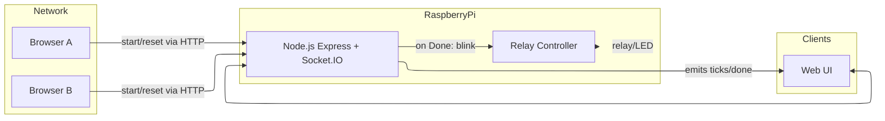
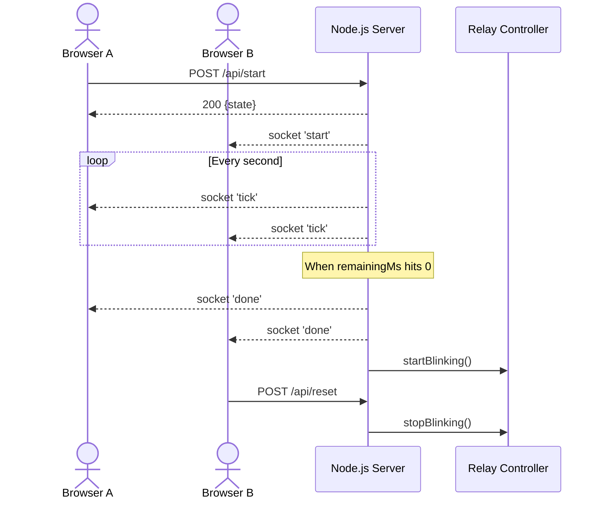

# tournament-countdown

[](https://github.com/xaxy55/tournament-countdown/actions/workflows/github-code-scanning/codeql)

A tiny real-time countdown web app. Everyone sees the same timer. You can start/reset via UI or HTTP API.

## Features
- Adjustable duration (default 30s)
- Start/reset via UI or REST API
- Real-time sync to all clients (Socket.IO)
- Optional Raspberry Pi GPIO relay blinking when time is up

## Run locally

1. Install dependencies
2. Start the server
3. Open http://localhost:3000

### API
- `POST /api/start` body: `{ "durationMs": number }`
- `POST /api/reset`
- `GET /api/state`

OpenAPI/Swagger:

- OpenAPI JSON: `/openapi.json`
- Swagger UI: `/api-docs`

## Notes
- This uses in-memory state; restarting the server clears the countdown.
- To expose publicly, put behind a reverse proxy or deploy to a host.

## Raspberry Pi relay output (optional)

When enabled, the Raspberry Pi will toggle a relay (or LED + resistor) using a GPIO pin and blink it when the timer completes ("Done"). Blinking stops on a new start or reset.

Env variables (set before `npm run start`):

- `GPIO_ENABLED=1` — turn on GPIO integration (default off)
- `RELAY_PIN=17` — BCM pin number to drive (default 17)
- `RELAY_ACTIVE_HIGH=1` — set `1` if relay energizes on logic HIGH; set `0` for active-LOW boards (default 1)
- `BLINK_HZ=2` — blink frequency while done (default 2 Hz)
- `BLINK_DURATION_MS=10000` — how long to blink after done (default 10000 ms)

Install deps and run on the Pi:

```sh
npm install
GPIO_ENABLED=1 RELAY_PIN=17 RELAY_ACTIVE_HIGH=1 BLINK_HZ=2 BLINK_DURATION_MS=10000 npm run start
```

Wiring:

- BCM 17 (pin 11) -> relay IN (or LED anode via a current-limiting resistor)
- 3.3V/GND as required by your relay board (use a transistor + diode for bare relays)
- Never drive a bare relay coil directly from a GPIO; use a transistor driver and flyback diode, or a relay module designed for 3.3V logic.

Notes:

- Requires the `onoff` package and access to `/sys/class/gpio` (run on Raspberry Pi OS; not on macOS/Windows)
- The server remains fully functional on non-Pi hosts; GPIO is disabled unless `GPIO_ENABLED=1`
- On shutdown or reset, the output is set LOW (relay off)

### Full setup on Raspberry Pi

1) Update OS and install Node.js and Git

```sh
sudo apt update
sudo apt upgrade -y
# Install Node.js 20 LTS via NodeSource (recommended)
curl -fsSL https://deb.nodesource.com/setup_20.x | sudo -E bash -
sudo apt install -y nodejs git
```

2) Get the app on the Pi and install deps

```sh
# If this repo is not already on the Pi
git clone https://github.com/xaxy55/tournament-countdown.git
cd tournament-countdown/counter-web
npm install
```

3) Test run (foreground)

```sh
GPIO_ENABLED=1 RELAY_PIN=17 RELAY_ACTIVE_HIGH=1 BLINK_HZ=2 BLINK_DURATION_MS=10000 PORT=3000 npm run start
```

4) Access from other devices on your network

- Find the Pi’s IP: `hostname -I`
- Open `http://<PI_IP>:3000` from any computer/phone on the same LAN
- Any connected browser can Start/Reset; the Pi will blink when the countdown finishes regardless of which device started it (server-side logic)

5) Run on boot with systemd (optional)

Create a unit file `/etc/systemd/system/tournament-countdown.service`:

```ini
[Unit]
Description=Tournament Countdown
After=network-online.target
Wants=network-online.target

[Service]
Type=simple
WorkingDirectory=/home/pi/tournament-countdown/counter-web
Environment=NODE_ENV=production
Environment=PORT=3000
Environment=GPIO_ENABLED=1
Environment=RELAY_PIN=17
Environment=RELAY_ACTIVE_HIGH=1
Environment=BLINK_HZ=2
Environment=BLINK_DURATION_MS=10000
ExecStart=/usr/bin/node server.js
Restart=on-failure
User=pi
Group=pi

[Install]
WantedBy=multi-user.target
```

Then enable and start it:

```sh
sudo systemctl daemon-reload
sudo systemctl enable tournament-countdown
sudo systemctl start tournament-countdown
sudo systemctl status tournament-countdown --no-pager
```

Troubleshooting tips:

- If GPIO access errors occur, try running as `root` or ensure your user has permission to access GPIO. Some relay boards are active-LOW; set `RELAY_ACTIVE_HIGH=0`.
- Ensure you’re using the correct BCM pin numbering and wiring. For bare relays, use a transistor driver + flyback diode, not direct GPIO.
- Change `PORT` if 3000 is in use.

## Illustrations

### Architecture overview



### Sequence of events

