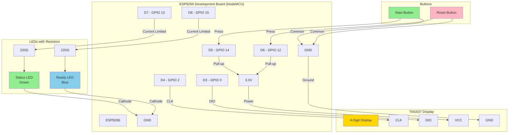

# Arduino ESP8266 Tournament Countdown Controller

This Arduino sketch provides physical button control for the Tournament Countdown server using an ESP8266 microcontroller with integrated 7-segment display.

## Features

- **2 Physical Buttons**: Start and Reset timer controls
- **2 Status LEDs**: Visual indicators for timer state
- **Connection Diagnostics**: LED flashing patterns indicate WiFi/WebSocket connection issues
- **Auto-Reconnection**: Automatically attempts to reconnect lost WiFi and WebSocket connections
- **7-Segment Display**: Real-time countdown display in MM:SS format (optional, can be disabled)
- **WiFi Connectivity**: Connects to tournament countdown server via HTTP API
- **Real-time Updates**: WebSocket connection for instant state synchronization
- **Robust Design**: Automatic reconnection and error handling
- **Configurable Display**: Display can be enabled/disabled via config.h to save memory and processing

## Hardware Requirements

- ESP8266 Development Board (e.g., NodeMCU ESP8266, Wemos D1 Mini)
- **TM1637 4-digit 7-segment display module** (optional - can be disabled in config.h)
- 2x Push buttons (momentary, normally open)
- 2x LEDs (different colors recommended - e.g., Green and Blue)
- 2x 220Ω resistors (for LED current limiting)
- 2x 10kΩ resistors (for button pull-ups - optional if using internal pull-ups)
- Breadboard and jumper wires
- USB cable for programming

**Note**: The 7-segment display is optional. Set `DISPLAY_ENABLED false` in config.h if you don't want to use it.

## Pin Configuration

| Component | ESP8266 Pin | NodeMCU Pin | Description |
|-----------|-------------|-------------|-------------|
| Start Button | GPIO 14 | D5 | Press to start timer |
| Reset Button | GPIO 12 | D6 | Press to reset timer |
| Status LED | GPIO 13 | D7 | Green LED - indicates timer running/done |
| Ready LED | GPIO 15 | D8 | Blue LED - indicates ready/idle state |
| Display CLK | GPIO 2 | D4 | 7-segment display clock |
| Display DIO | GPIO 0 | D3 | 7-segment display data |

## Wiring Diagram



## Circuit Details

### TM1637 Display Connections
- **VCC** → 3.3V or 5V power supply
- **GND** → Ground
- **CLK** → D4 (GPIO 2) - Clock signal
- **DIO** → D3 (GPIO 0) - Data signal

### Button Connections
- Connect one side of each button to its respective GPIO pin
- Connect the other side of each button to GND
- The ESP8266's internal pull-up resistors are used (configured in software)

### LED Connections
- Connect the anode (longer leg) of each LED to its respective GPIO pin through a 220Ω resistor
- Connect the cathode (shorter leg) of each LED to GND

## Software Setup

### 1. Install Arduino IDE and ESP8266 Support

1. Download and install [Arduino IDE](https://www.arduino.cc/en/software)
2. Add ESP8266 board support:
   - Go to **File > Preferences**
   - Add this URL to "Additional Board Manager URLs": 
     ```
     http://arduino.esp8266.com/stable/package_esp8266com_index.json
     ```
   - Go to **Tools > Board > Boards Manager**
   - Search for "esp8266" and install "ESP8266 by ESP8266 Community"

### 2. Install Required Libraries

In Arduino IDE, go to **Tools > Manage Libraries** and install:

- **ArduinoJson** by Benoit Blanchon (version 6.x)
- **WebSockets** by Markus Sattler
- **TM1637** by Avishay Orpaz (for 7-segment display - only required if `DISPLAY_ENABLED` is `true`)

### 3. Configure the Code

Copy `examples/config_example.h` to `tournament_controller/config.h` and update these values:

```cpp
// WiFi credentials
#define WIFI_SSID "YOUR_WIFI_SSID"
#define WIFI_PASSWORD "YOUR_WIFI_PASSWORD"

// Server configuration
#define SERVER_HOST "192.168.1.100"    // Your server's IP address
#define SERVER_PORT 3000
#define SERVER_URL "http://192.168.1.100:3000"  // Your server's URL

// Display configuration (optional)
#define DISPLAY_ENABLED true  // Set to false to disable display and save memory
```

**Important Display Configuration:**
- Set `DISPLAY_ENABLED true` if you have a TM1637 display connected
- Set `DISPLAY_ENABLED false` if you don't have a display or want to save memory
- When disabled, the TM1637Display library is not required

### 4. Upload to ESP8266

1. Connect your ESP8266 (NodeMCU) to your computer via USB
2. Select your ESP8266 board: **Tools > Board > ESP8266 Boards > NodeMCU 1.0 (ESP-12E Module)**
3. Select the correct port: **Tools > Port > [Your COM/USB Port]**
4. Click **Upload** to compile and upload the code

## Usage

### Display Features

The 7-segment display (when `DISPLAY_ENABLED` is `true`) shows:
- **Current countdown time** in MM:SS format for times ≥60 seconds (e.g., "01:30")
- **SS.T format** for times <60 seconds (e.g., "45.6" for 45.6 seconds)
- **"00.0"** when timer is idle or reset
- **Real-time updates** synchronized with the web interface

**Note**: If `DISPLAY_ENABLED` is set to `false`, all display functionality is disabled to save memory and processing power.

### LED Status Indicators

#### Normal Operation
| Ready LED (Blue) | Status LED (Green) | Timer State |
|------------------|-------------------|-------------|
| ON | OFF | Ready/Idle - waiting for start |
| OFF | ON | Timer running |
| OFF | Blinking | Timer finished |

#### Connection Error Indicators
| Ready LED (Blue) | Status LED (Green) | Connection State |
|------------------|-------------------|------------------|
| **Fast Flash** (200ms) | OFF | **WiFi connection failed** - Check WiFi credentials/signal |
| **Slow Flash** (1000ms) | OFF | **WebSocket connection failed** - Check server connectivity |

**Note**: During connection errors, the Ready LED will override normal timer state indicators. Once connections are restored, normal LED behavior resumes.

### Button Controls

- **Start Button**: Starts a 45-second countdown timer
- **Reset Button**: Resets the timer and returns to ready state

### Serial Monitor Output

Open the Serial Monitor (115200 baud) to see:
- WiFi connection status
- Button press confirmations
- Server communication status
- WebSocket events
- Timer state changes

## Troubleshooting

### Connection Issues

#### WiFi Connection Issues
- **Symptom**: Ready LED flashing FAST (200ms intervals)
- **Solutions**:
  - Verify SSID and password are correct in config.h
  - Ensure ESP8266 is within WiFi range
  - Check that your WiFi network is 2.4GHz (ESP8266 doesn't support 5GHz)
  - Check router settings - some routers have issues with IoT devices

#### WebSocket Connection Issues
- **Symptom**: Ready LED flashing SLOW (1000ms intervals)
- **Solutions**:
  - Verify the server IP address and port in config.h
  - Ensure the tournament countdown server is running
  - Check firewall settings on server
  - Verify network connectivity between ESP8266 and server

### Server Connection Issues
- Verify the server IP address and port
- Ensure the tournament countdown server is running
- Check firewall settings on the server
- Verify both devices are on the same network

### Button Not Responding
- Check button wiring and connections
- Verify buttons are normally-open type
- Check serial monitor for button press detection

### LEDs Not Working
- Verify LED polarity (anode to resistor, cathode to GND)
- Check resistor values (220Ω recommended)
- Test LEDs with a multimeter or battery

## API Integration

The controller uses these server endpoints:

- `POST /api/start` - Start the timer with 45-second duration
- `POST /api/reset` - Reset the timer
- `GET /api/state` - Check current timer state
- WebSocket connection for real-time updates

## Customization

### Changing Timer Duration

To change the default timer duration, modify this line:

```cpp
String payload = "{\"durationMs\": 45000}";  // 45 seconds
```

For example, for 60 seconds:
```cpp
String payload = "{\"durationMs\": 60000}";  // 60 seconds
```

### Adding More LEDs or Buttons

You can extend the design by:
- Adding more GPIO pins for additional buttons/LEDs
- Implementing different timer presets
- Adding buzzer for audio feedback
- Using RGB LEDs for more status colors

### Display Configuration

For detailed information about configuring the 7-segment display, including how to enable/disable it and troubleshooting, see [DISPLAY_CONFIGURATION.md](DISPLAY_CONFIGURATION.md).

## License

This code is part of the tournament-countdown project and follows the same license terms.