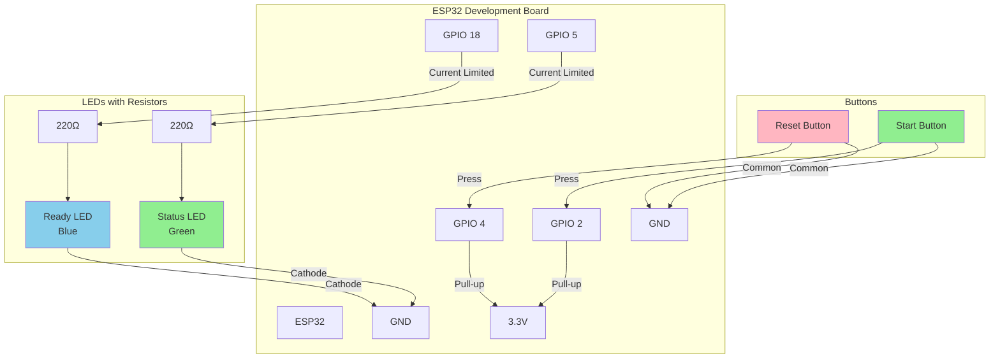

# Arduino ESP32 Tournament Countdown Controller

This Arduino sketch provides physical button control for the Tournament Countdown server using an ESP32 microcontroller.

## Features

- **2 Physical Buttons**: Start and Reset timer controls
- **2 Status LEDs**: Visual indicators for timer state
- **WiFi Connectivity**: Connects to tournament countdown server via HTTP API
- **Real-time Updates**: WebSocket connection for instant state synchronization
- **Robust Design**: Automatic reconnection and error handling

## Hardware Requirements

- ESP32 Development Board (e.g., ESP32-WROOM-32, NodeMCU-32S)
- 2x Push buttons (momentary, normally open)
- 2x LEDs (different colors recommended - e.g., Green and Blue)
- 2x 220Ω resistors (for LED current limiting)
- 2x 10kΩ resistors (for button pull-ups - optional if using internal pull-ups)
- Breadboard and jumper wires
- USB cable for programming

## Pin Configuration

| Component | ESP32 Pin | Description |
|-----------|-----------|-------------|
| Start Button | GPIO 2 | Press to start timer |
| Reset Button | GPIO 4 | Press to reset timer |
| Status LED | GPIO 5 | Green LED - indicates timer running/done |
| Ready LED | GPIO 18 | Blue LED - indicates ready/idle state |

## Wiring Diagram



## Circuit Details

### Button Connections
- Connect one side of each button to its respective GPIO pin
- Connect the other side of each button to GND
- The ESP32's internal pull-up resistors are used (configured in software)

### LED Connections
- Connect the anode (longer leg) of each LED to its respective GPIO pin through a 220Ω resistor
- Connect the cathode (shorter leg) of each LED to GND

## Software Setup

### 1. Install Arduino IDE and ESP32 Support

1. Download and install [Arduino IDE](https://www.arduino.cc/en/software)
2. Add ESP32 board support:
   - Go to **File > Preferences**
   - Add this URL to "Additional Board Manager URLs": 
     ```
     https://dl.espressif.com/dl/package_esp32_index.json
     ```
   - Go to **Tools > Board > Boards Manager**
   - Search for "esp32" and install "ESP32 by Espressif Systems"

### 2. Install Required Libraries

In Arduino IDE, go to **Tools > Manage Libraries** and install:

- **ArduinoJson** by Benoit Blanchon (version 6.x)
- **WebSockets** by Markus Sattler

### 3. Configure the Code

Open `tournament_controller.ino` and update these values:

```cpp
// WiFi credentials
const char* ssid = "YOUR_WIFI_SSID";
const char* password = "YOUR_WIFI_PASSWORD";

// Server configuration
const char* serverHost = "192.168.1.100";  // Your server's IP address
const int serverPort = 3000;
const char* serverURL = "http://192.168.1.100:3000";  // Your server's URL
```

### 4. Upload to ESP32

1. Connect your ESP32 to your computer via USB
2. Select your ESP32 board: **Tools > Board > ESP32 Arduino > [Your ESP32 Board]**
3. Select the correct port: **Tools > Port > [Your COM/USB Port]**
4. Click **Upload** to compile and upload the code

## Usage

### LED Status Indicators

| Ready LED (Blue) | Status LED (Green) | Timer State |
|------------------|-------------------|-------------|
| ON | OFF | Ready/Idle - waiting for start |
| OFF | ON | Timer running |
| OFF | Blinking | Timer finished |
| Alternating | Alternating | WiFi connection error |

### Button Controls

- **Start Button**: Starts a 45-second countdown timer
- **Reset Button**: Resets the timer and returns to ready state

### Serial Monitor Output

Open the Serial Monitor (115200 baud) to see:
- WiFi connection status
- Button press confirmations
- Server communication status
- WebSocket events
- Timer state changes

## Troubleshooting

### WiFi Connection Issues
- Verify SSID and password are correct
- Ensure ESP32 is within WiFi range
- Check that your WiFi network is 2.4GHz (ESP32 doesn't support 5GHz)

### Server Connection Issues
- Verify the server IP address and port
- Ensure the tournament countdown server is running
- Check firewall settings on the server
- Verify both devices are on the same network

### Button Not Responding
- Check button wiring and connections
- Verify buttons are normally-open type
- Check serial monitor for button press detection

### LEDs Not Working
- Verify LED polarity (anode to resistor, cathode to GND)
- Check resistor values (220Ω recommended)
- Test LEDs with a multimeter or battery

## API Integration

The controller uses these server endpoints:

- `POST /api/start` - Start the timer with 45-second duration
- `POST /api/reset` - Reset the timer
- `GET /api/state` - Check current timer state
- WebSocket connection for real-time updates

## Customization

### Changing Timer Duration

To change the default timer duration, modify this line:

```cpp
String payload = "{\"durationMs\": 45000}";  // 45 seconds
```

For example, for 60 seconds:
```cpp
String payload = "{\"durationMs\": 60000}";  // 60 seconds
```

### Adding More LEDs or Buttons

You can extend the design by:
- Adding more GPIO pins for additional buttons/LEDs
- Implementing different timer presets
- Adding buzzer for audio feedback
- Using RGB LEDs for more status colors

## License

This code is part of the tournament-countdown project and follows the same license terms.