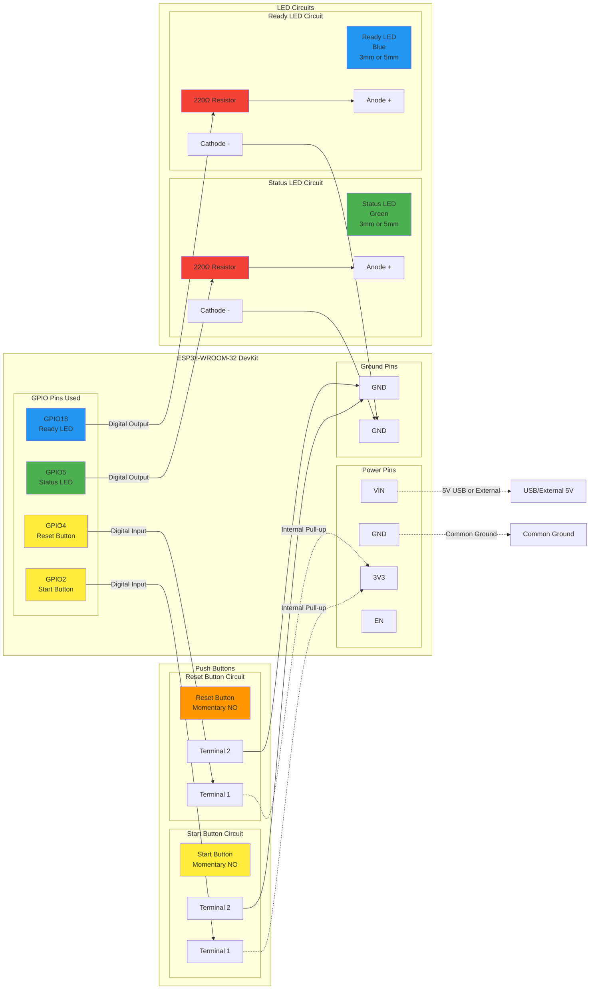
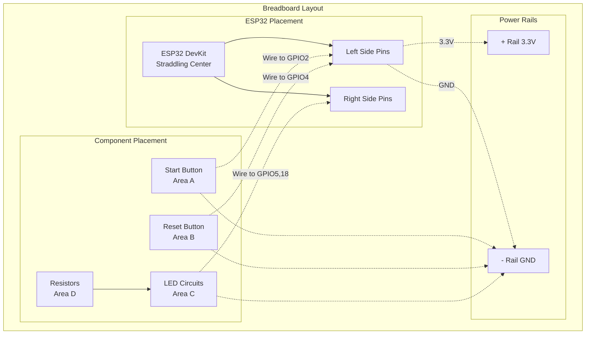

# ESP32 Tournament Controller - Detailed Wiring Diagram

## Circuit Schematic



## Breadboard Layout



## Component Specifications

### ESP32 Development Board
- **Model**: ESP32-WROOM-32 or compatible
- **Operating Voltage**: 3.3V (5V tolerant on some pins)
- **Flash Memory**: 4MB minimum
- **WiFi**: 802.11 b/g/n

### Push Buttons
- **Type**: Momentary contact, normally open (NO)
- **Rating**: 12V DC, 50mA minimum
- **Mounting**: Through-hole or surface mount
- **Debouncing**: Handled in software

### LEDs
- **Status LED**: Green, 3mm or 5mm
  - **Forward Voltage**: ~2.0-2.2V
  - **Forward Current**: 20mA
- **Ready LED**: Blue, 3mm or 5mm
  - **Forward Voltage**: ~3.0-3.3V
  - **Forward Current**: 20mA

### Resistors
- **Value**: 220Ω
- **Power Rating**: 1/4W minimum
- **Tolerance**: 5% or better
- **Type**: Carbon film or metal film

## Electrical Calculations

### LED Current Limiting Resistors

For Green LED (Status):
```
R = (Vcc - Vf) / If
R = (3.3V - 2.1V) / 0.02A = 60Ω minimum
```

For Blue LED (Ready):
```
R = (Vcc - Vf) / If  
R = (3.3V - 3.1V) / 0.02A = 10Ω minimum
```

**Note**: 220Ω is used for both to provide a safety margin and similar brightness levels.

## Wire Connections Summary

| From | To | Wire Color Suggestion | Function |
|------|----|--------------------|----------|
| ESP32 3.3V | Breadboard + Rail | Red | Power |
| ESP32 GND | Breadboard - Rail | Black | Ground |
| ESP32 GPIO2 | Start Button Pin 1 | Yellow | Start Input |
| Start Button Pin 2 | GND Rail | Black | Button Ground |
| ESP32 GPIO4 | Reset Button Pin 1 | Orange | Reset Input |
| Reset Button Pin 2 | GND Rail | Black | Button Ground |
| ESP32 GPIO5 | 220Ω Resistor | Green | Status LED Control |
| 220Ω Resistor | Green LED Anode | Green | LED Positive |
| Green LED Cathode | GND Rail | Black | LED Ground |
| ESP32 GPIO18 | 220Ω Resistor | Blue | Ready LED Control |
| 220Ω Resistor | Blue LED Anode | Blue | LED Positive |
| Blue LED Cathode | GND Rail | Black | LED Ground |

## Safety Notes

- Always disconnect power when making wiring changes
- Verify polarity of LEDs before applying power
- Ensure proper current limiting with resistors
- Use appropriate wire gauge (22-26 AWG recommended)
- Double-check connections before powering on